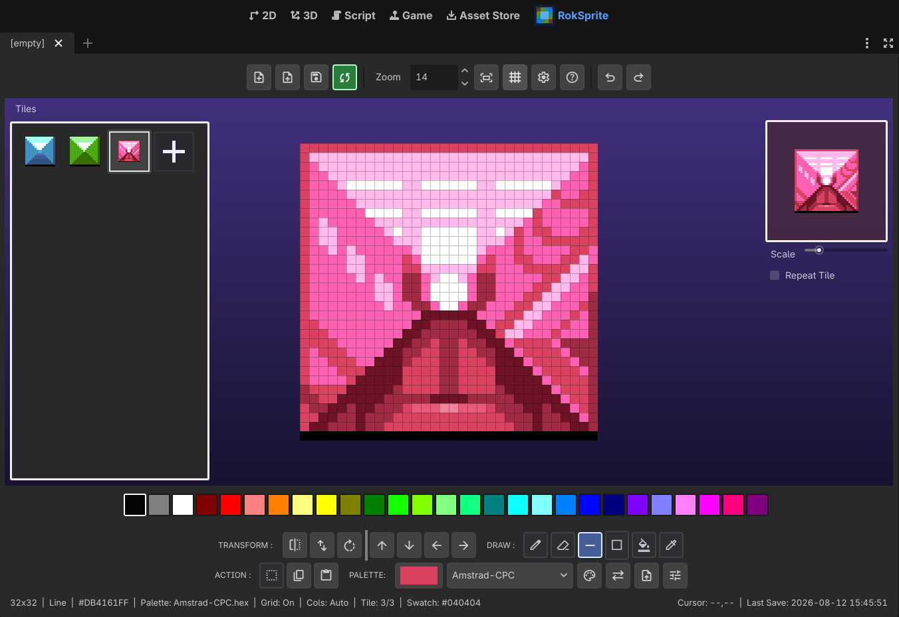
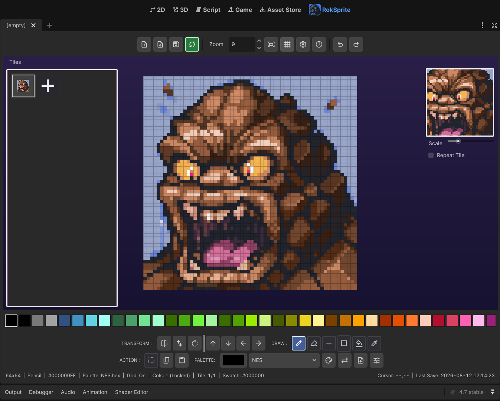

# RokSprite

  

RokSprite is a Godot 4 editor plugin for drawing square pixel-art tiles, managing TileSets, applying palette operations, and loading/saving PNG sprite sheets.

## Screenshots

## Highlights

- Pencil, eraser, line, rectangle, fill, picker, selection, and transform tools.
- Chronological undo/redo across canvas, palette, and tile-list changes.
- PNG sheet import/export that preserves the dimensions of loaded sheets, including transparent trailing cells.
- Versioned crash/session recovery stored only under `user://roksprite/`.
- Optional sync to an explicitly selected PNG path.

## Getting started

1. Install and enable the plugin, then open the **RokSprite** main-screen tab.
2. Create a TileSet or load an existing PNG sprite sheet.
3. Add, duplicate, reorder, edit, and preview tiles using the tile panel and canvas tools.
4. Choose or import a palette, derive one from the loaded image, or remap the TileSet to the selected palette.
5. Save the TileSet as a PNG. Once a path has been established, **Sync** updates that linked PNG directly.

## Keyboard shortcuts

| Shortcut | Action |
| --- | --- |
| `Ctrl/Cmd + Z` | Undo the newest canvas, palette, or tile-list change |
| `Ctrl/Cmd + Shift + Z` | Redo |
| `Ctrl/Cmd + Y` | Redo |
| `Ctrl/Cmd + S` | Sync changes to the linked PNG path |
| `Space` | Pick the colour under the canvas cursor |
| `'` (apostrophe) | Toggle the pixel grid |
| `Delete` or `Backspace` | Delete the active selection |

## Mouse controls

| Input | Action |
| --- | --- |
| Left drag | Use the selected drawing tool |
| Mouse wheel over canvas | Zoom in or out |
| Middle-mouse drag | Pan the canvas |
| Right-mouse drag | Temporarily erase without switching tools |
| Right-click Rotate | Rotate the selection or canvas 90 degrees counter-clockwise |
| Mouse wheel over Tiles | Scroll the tile list instead of zooming |
| Right-click a palette-balance slider | Reset that slider to 0% |

## Tiles and selections

- Drag a tile onto the **+** tile to duplicate it.
- Right-click the selected tile to confirm delete/clear.
- Use **Copy** and **Paste** for the current tile.
- Transform controls flip, rotate, or shift the active selection; without a selection they operate on the full canvas.
- With **Select**, drag to create a marquee and drag inside it to move its pixels.
- Double-click **Select** to toggle copy-drag mode. The button is blue in move mode and green in copy-drag mode.
- Double-click **Square** to toggle between outline and solid drawing.

## Saving and recovery

- **Save** writes the TileSet PNG and establishes its linked sync path.
- The Sync button is red when the linked PNG has pending changes and green when it is current.
- Loaded sheet dimensions are retained while its source layout is locked, including transparent trailing cells.
- Recovery state is versioned and stored atomically at `user://roksprite/session-v2.dat`.
- Preferences are stored at `user://roksprite_settings.cfg`; the addon directory is not used for session data.

See [INSTALL.md](addons/roksprite/INSTALL.md) for installation and enablement. The plugin is distributed under [the MIT licence](addons/roksprite/LICENSE); bundled third-party material is listed in [THIRD_PARTY_NOTICES.md](addons/roksprite/THIRD_PARTY_NOTICES.md).

## Compatibility

The plugin targets Godot 4.x and is tested headlessly with Godot 4.7.
